  

# RFID Interrogator

### Designed by: Nicholas Chavez, Pin-Yi Yeh

  

---

  

### Featured Skills and Tools:
  - Altium Designer
  - Circuit Design
  - PCB Design
  - Transmission Line
  - Length Matching
  - Via Sheilding
  - FCC Complience

  

---

  

# Design objective and goal

The design for the reader was determined by certain needs. The need to ensure that the tags can be read from a distance, targeting 3 feet, and be cost-effective enough to undercut the cost of competitors by a few hundred dollars. The first aspect of meeting these requirements is to ensure that the design meets legal requirements for being sold. In the case of this project, the market was the US, which has requirements shown in Table 1.

 

  
Table 1: Design Parameters

<table border="1">
  <tr>
    <td>Operating Frequency</td>
    <td>902 MHz - 928 MHz</td>
  </tr>
  <tr>
    <td>Channel Spacing  </td>
    <td>500 KHz</td>
  </tr>
  <tr>
    <td>Max Transmitted Power</td>
    <td> +30 dBm </td>
  </tr>
  <tr>
    <td> Data Rate </td>
    <td> 26.7 Kbps - 128 Kbps</td>
  </tr>
  <tr>
    <td> Reader Modulation  </td>
    <td> DSB/SSB/PR-ASK </td>
  </tr>
</table>

 

On top of these requirements, the device should be functional in a variety of environments and should perform on par with more established brands.

 

## Theory

The fundamental purpose of RFID is to receive and send data. To do this over the air, it is most effective to utilize higher frequency bandwidths to prevent data loss from interference sources. However, processing frequencies at that speed is difficult, and as such, it becomes favorable to demodulate the frequency, so the data waveform can be analyzed at lower frequencies. For this, amplitude modulation is used. However, the receiving data can also include many unwanted interference signals from the environment or other electromagnetic sources, and so the signal needs to be filtered. The signal may also be weak, and as such it must also be amplified. Figure 1 shows the general processing of a signal from the antenna to the microcontroller.

 

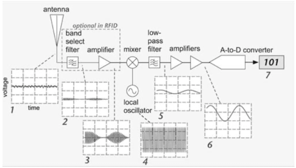
 
Figure 1: The RF Signal Processing diagram showing the signal at each stage. (Dobkin, 2008)
 

 

From left to right, the weak signal enters the antenna and is filtered so only the desired range of frequencies is passed through, and then amplified. Here it goes into a mixer, with an oscillator, to then demodulate the signal, in order to leave only the peaks that contain the data. That signal is then processed through the Analog to digital converter, and is output as a digital signal, in this case, Serial Protocol Interface, or SPI.

One of the first decisions to be made was the frequency range that needed to be isolated. Since the goal was UHF, and the market was in the US, the range was 902MHz - 928MHz, per the FCC standards. In order to isolate a range, a bandpass filter is used, getting a frequency response as shown in Figure 2.

 

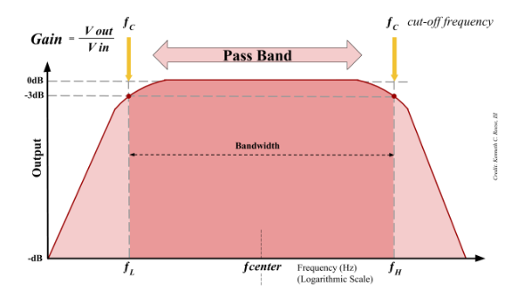
 
Figure 2: Band Pass Filter Bode Plot. (Heath, 2021)
 

 

In order to isolate the correct range, a Chebyshev filter design was used for its steep roll-off properties, better isolating the passband portion of the filter. Figure 3 shows an example of a Chebyshev filter.

 

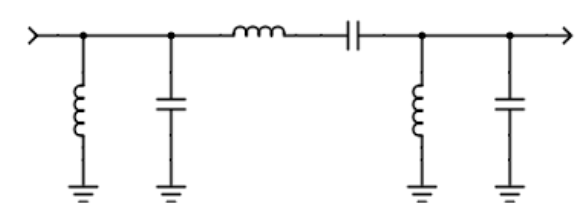
 
Figure 3: Chebyshev bandpass filter.
 

 

To ensure that the filter has the correct capacitor values we can use a few useful equations. First, knowing that our bandwidth is 902-928MHz, allows us to utilize the following equation:

$$
BW = \frac{f_0}{Q}
$$

where BW is the bandwidth, f0, is the center frequency and Q is the quality factor, which for RFID is typically 10-20. Solving for fowill then give the center frequency.

$$
f_0 = \frac{1}{2 \pi \sqrt{LC}}
$$

With this information, we can calculate values for the inductor and capacitor by utilizing the angular frequency, 0=2fo, and using the following equations.

$$
L = \frac{1}{\omega_0^2 C}
$$

$$
C = \frac{1}{\omega_0^2 L}
$$

The signal integrity of the filter, however, depends on much more than just the capacitors and inductors used for the design. One important consideration is the material that the signal passes through. Since the intent is to utilize Ultra High Frequency (UHF) RFID, the material must have a low dielectric constant and low loss tangent. For this reason, a PCB material such as Rogers 4003C would be much more effective than a standard FR-4 material. Table 2 shows a comparison of the two materials.

 

Table 2: Rogers 4003C vs FR4

<table border="1">
  <tr>
    <th>Material</th>
    <th>Rogers 4003C</th>
    <th>FR-4</th>
  </tr>
  <tr>
    <td>Dielectric Constant</td>
    <td> 3.3-3.5</td>
    <td>4.5</td>
  </tr>
  <tr>
    <td>Loss Tangent  </td>
    <td>0.0027</td>
    <td>4.5</td>
  </tr>
  <tr>
    <td>Impedance Stablility </td>
    <td> Excellent </td>
    <td>Moderate </td>
  </tr>

</table>

 

Signal integrity is at the core of the design, as it is important to minimize loss and reflections along the path of the signal. Another important consideration in this regard is ensuring that the traces follow a set of important rules in order to ensure that reflections and loss are minimized.

 

One aspect of this is ensuring that the traces maintain an impedance that is consistent across the circuit. To ensure that the signal was well shielded as well, we chose a coplanar waveguide as shown in Figure 4.

 

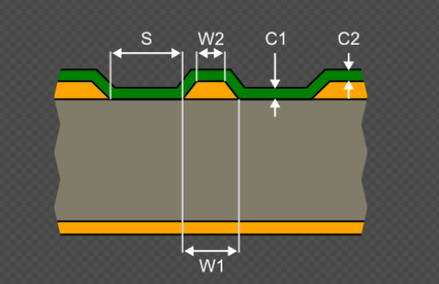
 
Figure 4: Coplanar Waveguide. (Altium Designer)
 

 

The target impedance for RFID antenna is 50, which means our traces need a characteristic impedance, Z0, that is the same. The impedance of a copper trace is defined by the cross-sectional area, and as the thickness can be defined at the standard 1OZ or .035mm, the width is the parameter that needs to be defined. This can be done via the equation:

$$
Z_0 = \frac{60}{\sqrt{\varepsilon_\text{eff}}} \ln\left( 1 + \frac{4h}{w + 2g} \right)
$$

where,

$$
\varepsilon_\text{eff} = \frac{\varepsilon_r + 1}{2} + \frac{\varepsilon_r - 1}{2} \cdot \frac{1}{\sqrt{1 + 12 \frac{h}{w}}}
$$

and r is the substrate’s dielectric constant, h is the height of the substrate, w is the width of the trace, and g is the gap between the trace and ground.

This works for the single line traces, but there are also considerations that need to be made when incorporating differential traces (Figure 5), which are needed for the modulator and demodulator receiving and sending differential signals to the ADC and DAC respectively. The same equation cannot be used however for these traces, as the mechanics for the traveling wave differ in a differential waveguide.

 

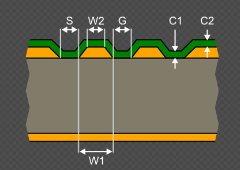
 
Figure 5: Differential Coplanar Waveguide. (Altium Designer)
 

 

For a differential waveguide, it is necessary to utilize the differential impedance rather than the characteristic impedance. To find this, the equation,

$$
Z_\text{diff} = 2 Z_0 (1 - c)
$$

is used, where c is the coupling coefficient of the two differential traces, defined as,

$$
c = \frac{C_m}{C_m + C_s}
$$

where cm is the mutual capacitance between the two traces, and cs is the capacitance of each trace to ground. The differential impedance can then be defined as:

$$
Z_\text{diff} = \frac{120 \pi}{\sqrt{\varepsilon_\text{eff}}} \cdot \frac{K(k_s')}{K(k_s)}
$$

where,

$$
k = \frac{w}{w + 2g}
$$

Another source of potential signal reflection is at the connections of the traces to pads or vias. In order to minimize reflections from these harsh connections, a teardrop taper is necessary to allow for the signal to adjust to potential impedance changes at these points gradually so as to reduce the amount of reflections caused by the impedance change. This technique is shown in Figure 6:

 

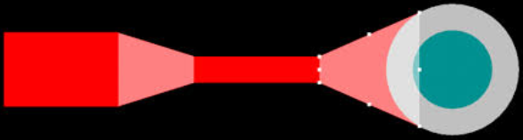
 
Figure 6: Tear Drop taper from pad to trace to via.
 

 

These teardrop traces need to follow a rule: The length of the taper must be more than three times the width of the difference between the trace and the pad/via. This will allow for the signal to remain largely intact.

 

Additionally, another source of potential issues would be at turns where the trace can no longer travel in a straight line to reach the desired point. Angles at 90 degrees can cause complete signal loss, and at ultra-high frequencies, even 45-degree angles can still lead to many issues with signal integrity. As such, instead of hard angles, a radial curve must be utilized for turning the traces along a path. These traces also follow a similar rule, where the radius that the trace travels must be at least over three times the width of the trace. (Figure 7)

 

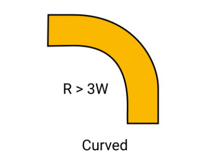
 
Figure 7: Curve needed for routing traces.
 

 

This resolves issues with signal integrity, but another consideration comes along when considering signals that need to be in phase. For these situations, it is necessary to ensure that the signal reaches its destination at practically the same time as another trace. To do this, a length-matching technique must be used, where one wire is routed with alternating curves to ensure the length is matched with the other trace. (Figure 8)

 

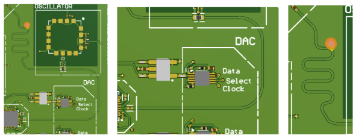
 
Figure 8: Length matched Traces(Right), trace  1 (center), length matched trace 2 (right).
 

 

##	Overall System

The overall system being designed is the transceiver itself, allowing for specific parameter adjustments that can be utilized to save cost. The system connects an antenna to the RF Front End, which starts with a circulator that sends and receives signals concurrently. Then the received signal is processed through the RX, or receiving, side, and filtered, amplified, and demodulated to then send to the baseband processing side, where it is converted from an analog signal to a digital one to be read by the microcontroller. The sending signal starts at the microcontroller and is sent through the TX, or transmission, side and is converted from digital to analog, and modulated into a higher frequency to be processed in the RF Front end. There it is filtered and amplified to be sent out the circulator to the antenna. The block diagram for this system is represented in Figure 9.

 

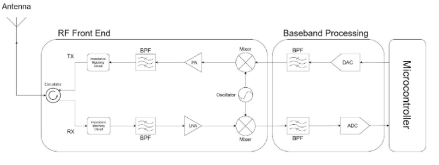
 
Figure 9: RF Block Diagram
 

 

In order to properly facilitate the design, the board needs to be separated into multiple layers. This is to ensure that the RF signals are not interfered with by other elements of the device, such as the power and the SPI signals, and to have a layer to act as a unified ground. Figure 10 shows the stack up, with L1 being the RF Layer, L2 being the Ground plane, L3 being the Power Plane, and L4 being the SPI Layer.

 

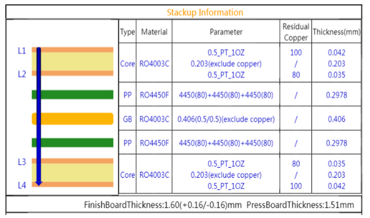
 
Figure 10: Stackup for PCB.
 

 

## RF Front End

For the RF front-end portion of the design, the focus was to ensure that the signal remained intact and that only the correct frequencies were processed. This starts with designing the bandpass filter, which was chosen to be a Chebyshev filter. Utilizing frequency tools, the capacitance and inductance of each component were determined, and the resulting design is shown in Figure 11, and the frequency response in Figure 12.

 

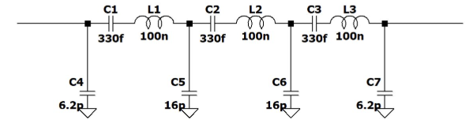
 
Figure 11: Bandpass Filter for a bandwidth of 902-928MHz.
 

 

 

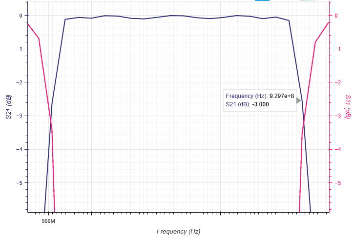
 
Figure 12: Bandpass filter frequency response.
 

 

The next task was to select components for the remaining portion of the circuit. For the RF Front end that meant selecting the components that would be processing all of the UHF signals. The Schematic was then drawn up in Altium Designer as shown in Figure 13.

 

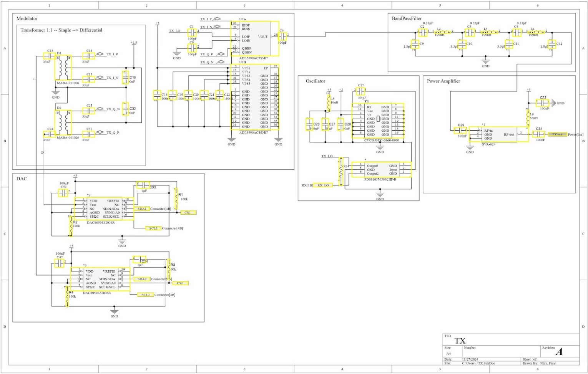
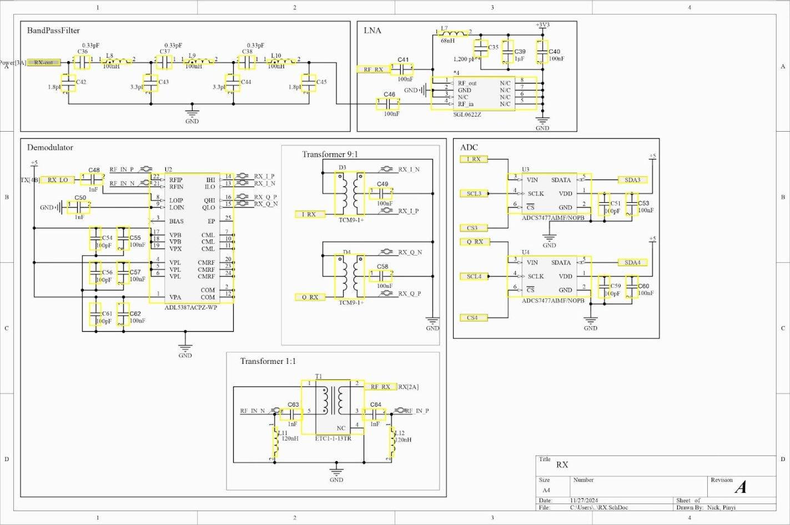
 
Figure 13: Altium Designer schematic for TX(top) and RX(bottom) portions of the design.
 

 

This was then transferred to a PCB design, using Altium Designer again, to conduct all connections and appropriate calculations for the PCB requirements. The PCB is shown in Figure 14.

 

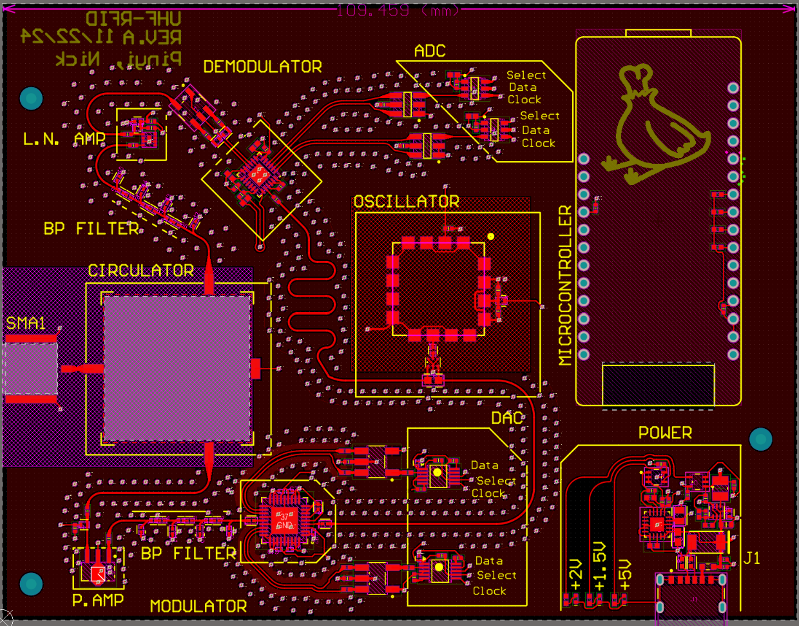
 
Figure 14: RF Front End PCB layer.
 

 

The entire RF Front end needed to be shielded from other components, and as such, a ground layer was then placed directly below, which also connected to all the necessary grounding vias that were placed for the components. (Figure 15)

 

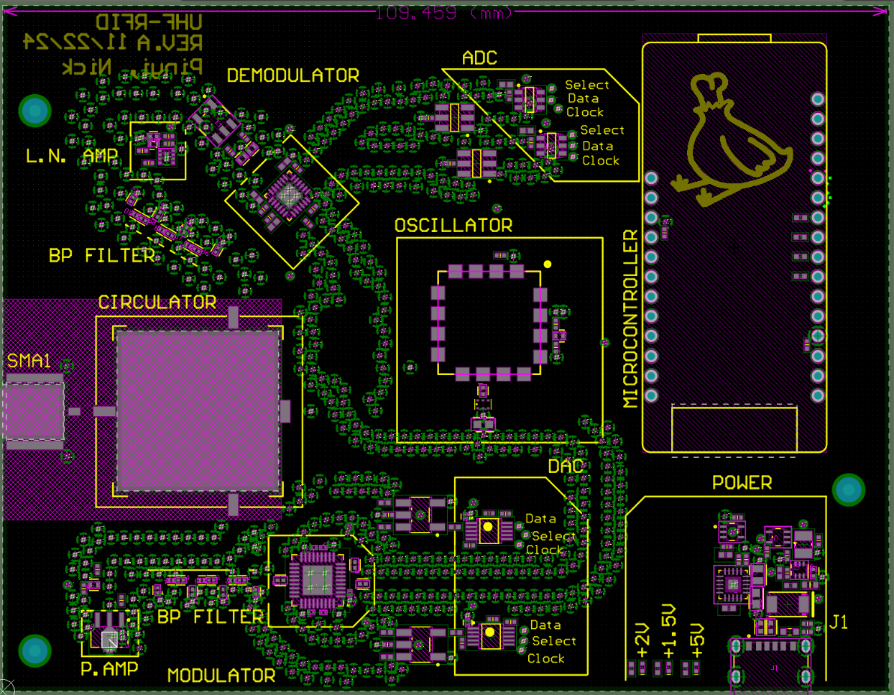
 
Figure 15: Ground Plane, with all Vias (in green).
 

 

## Basband Processing

The baseband portion of the circuit directly follows the DACs and ADCs of the TX and RX circuits respectively. These connections were run through to the bottom layer of the board to separate the routing of the SPI traces from the RF traces. These were then sent to the microcontroller which was designed to be placed on board as well. The Schematic for the SPI connections can be seen in Figure 16, showing the microcontroller connections.

 

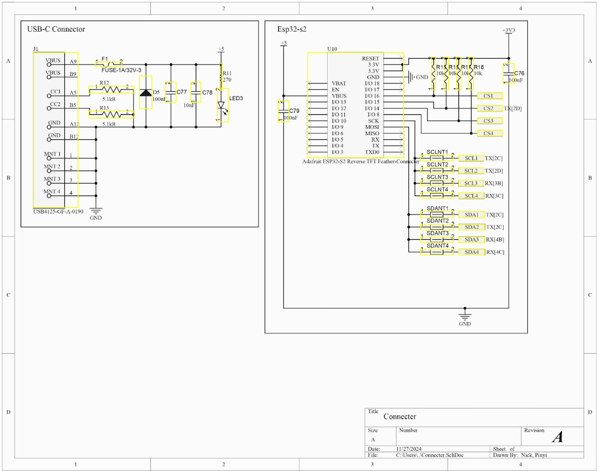
 
Figure 16: Schematic of Connectors, including ESP32 Microcontroller.
 

 

There are pairs for the ADCs and DACs, since the demodulated and modulated signals are done through a differential, which has a phase shift of 90 degrees, however, the microcontroller sends data and clock information via a single pin for each. This means that the microcontroller must select the active component of the 4, and then send data to the correct component. This means that the Clock and Data traces running to each of the 4 components must be of the same length to ensure appropriate timing from the components and the microcontroller. The selection pins for selecting the active component must also be length-matched to each other but can be different in length from the clock and data traces. The routing of these traces can be seen in Figure 17.

 

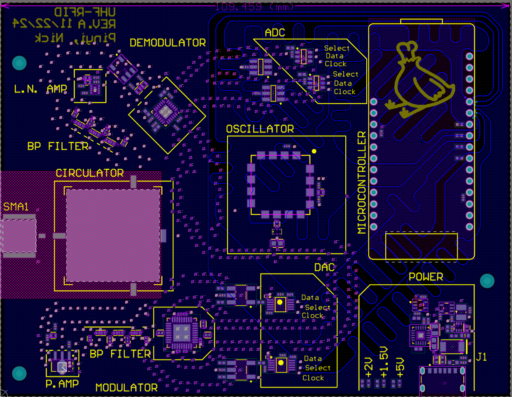
 
Figure 17: SPI Traces, length matched from ADCs and DACs to the microcontroller.
 

 

## Power Delivery

In our design, we require various voltages for distinct purposes.
 

5V: This voltage is delivered through a USB-C port, with a Fuse for overcurrent protection and a Transient Voltage Suppression (TVS) diode for overvoltage protection, ESD protection, and reverse polarity protection. Using a fuse and TVS diode can protect the circuit and ensure system stability. The schematic diagram can be seen in the figure 16.

 
 
3.3V: This voltage is provided by the voltage regulator on the microcontroller board and delivered to the LNA.

 
 
2V: This voltage is used to maintain voltage control. The Oscillator is about to produce the desired stable frequency. We choose to use a buck converter to provide a stable output voltage of 2V.

 
 
1.5V: This voltage is needed for the transformers situated between the Modulator and the DAC. These transformers are designed to convert the single-ended signal into a differential signal, using the 1.5V to provide the necessary bias voltage for the Modulator. We selected an LDO to generate the 1.5V for the transformer because it features an ultra-low dropout voltage and a high power supply rejection ratio.

 

For each voltage level, we install an LED voltage indicator along with an OR gate. This setup offers visual feedback to the user and is particularly useful for circuit debugging. The light serves as a safety indicator, warning users that power remains in the circuit, which helps prevent accidental damage or electric shock.

 

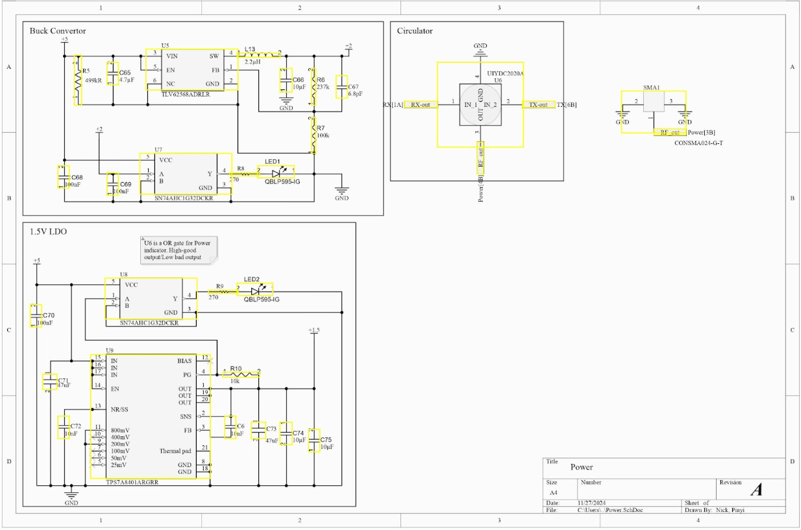
 
Figure 17: Schematic for Power Delivery
 

 

 

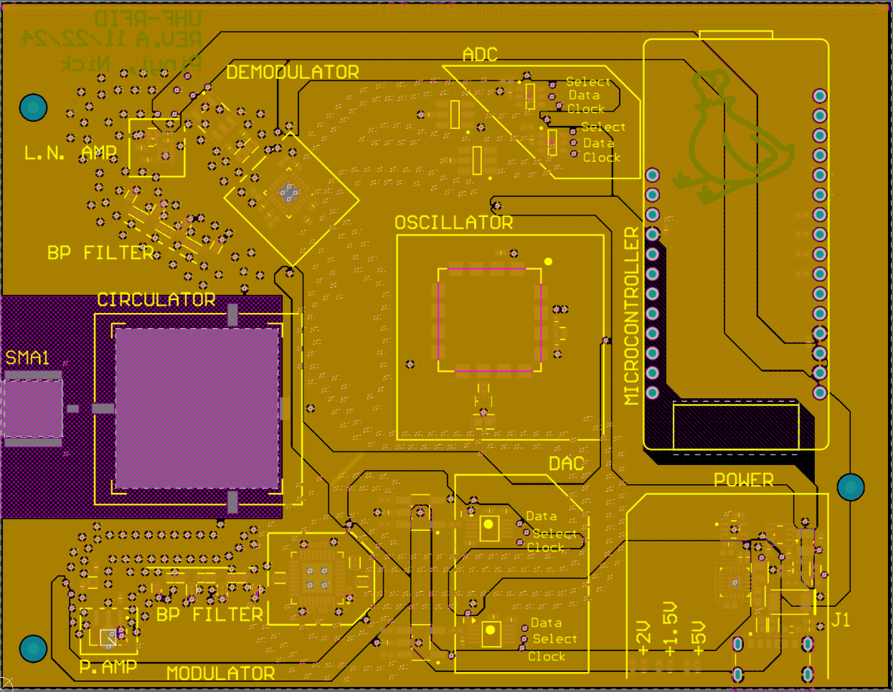
 
Figure 18: Power Delivery Layer.
 

 

## Via Sheilding

​​In our UHF circuit design, applying shielding using via is essential to maintain signal integrity and minimize electromagnetic interference (EMI). Frequency in this range makes it easy to have crosstalk, ground bounce, and signal loss due to poor PCB layout. To fix this issue, we use shielding around critical signal paths such as UHF RF signals and differential pair signals.

 

The main reasons for using via shielding for our design were:

 

Reducing crosstalk: surround targeted signal with the ground via minimizing electromagnetic coupling.

 

Stabilizing Ground Potential: shielding vias can provide an additional path for returning current. This can stabilize ground voltage and reduce ground pounce.

 

Improve Signal Integrity: placing via around the trace and creating electromagnetic fields around the trace, which will reduce signal reflections and maintain clean transmission.

 

Reducing EMI: Shielding Vias will act as a barrier, protecting sensitive components from other noise sources and improving overall performance.

 

The placement of the shielding vias needs to be calculated in order to maximize performance. The calculation will need to consider our operating frequency ( $f_\text{max} = 928 \,\text{MHz}$ ) and dielectric properties of the Rogers PCB ( $\varepsilon_\gamma = 3.5$ ). The maximum spacing can be calculated by using the equation shown below. c is the speed of light ( $3 \times 10^8 \,\text{m/s}$ ).

 

$$
\text{Max Via Spacing (mm)} = \frac{1}{10} \cdot \frac{c}{f \sqrt{\varepsilon_\gamma}}
$$

 

From the equation, we can get the maximum distance between the vias, which will be approximately 10mm apart. Our design uses a distance of 1 mm because of the restricted board size. This 1 mm spacing enhances signal shielding, which is crucial for a compact PCB design.

 

---

## References

 Dobkin, D. M. (2008). *The RF in RFID: Passive UHF RFID in practice*. Elsevier / Newnes.
   
 Sarma, Sanjay. (2009). “RFIDSim - A physical and logical layer simulation engine for passive RFID.” *Automation Science and Engineering, IEEE Transactions on*, 6, 33–43. [DOI: 10.1109/TASE.2008.2007929](https://doi.org/10.1109/TASE.2008.2007929)
   
 Schweber, B. (2014, March 6). “The Smith chart: An ‘ancient’ graphical tool still vital in RF Design.” DigiKey. [Link](https://www.digikey.com/en/articles/the-smith-chart-an-ancient-graphical-tool-still-vital-in-rf-design)
   
 Tait Radio Academy. (2018, January 2). “How does modulation work?” Tait Radio Academy. [Link](https://www.taitradioacademy.com/topic/how-does-modulation-work-1-1/)

